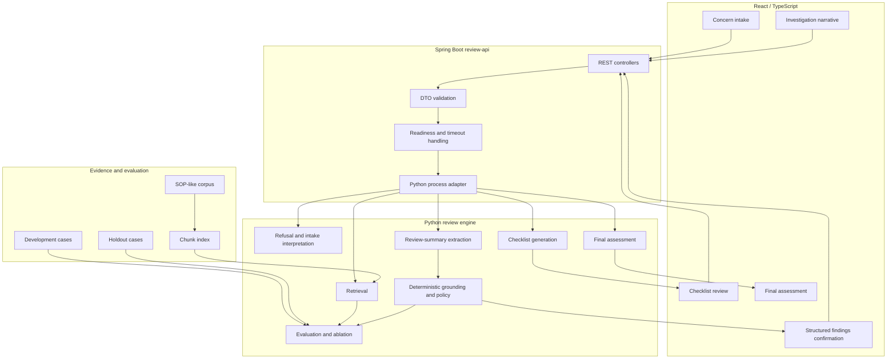
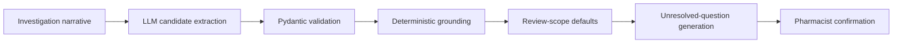

<div align="center">

# Compounding Quality RAG

**Human-in-the-loop review support for compounding-quality complaints, product questions, adverse-event reports, and pharmacist investigation narratives**

[](https://react.dev/)
[](https://www.typescriptlang.org/)
[](https://spring.io/projects/spring-boot)
[](https://openjdk.org/)
[](https://www.python.org/)
[](https://docs.pydantic.dev/)
[](https://vite.dev/)


</div>

---

## Overview

Compounding-quality review often begins with incomplete, inconsistent, or highly informal language:

- a customer complaint;
- a clinic question;
- a negative product review;
- a reported adverse event;
- a pharmacist investigation note.

**Compounding Quality RAG** organizes that information into an evidence-grounded review workflow. It helps a pharmacist identify relevant guidance, surface unresolved facts, review proposed structured findings, and generate a final assessment.

> [!IMPORTANT]
> The application supports pharmacist review. It does **not** make autonomous clinical, legal, quality, or customer-resolution decisions.

The repository demonstrates a production-shaped AI workflow across three application layers:

| Layer | Responsibility |
|---|---|
| **React / TypeScript** | Reviewer workflow, preloaded demo cases, structured confirmation, evidence display, readiness, retry, and error states |
| **Spring Boot** | HTTP contracts, validation, orchestration, readiness, timeout handling, process lifecycle, and error translation |
| **Python** | Retrieval, extraction, deterministic grounding, review policy, final assessment, and evaluation |

---

## Product Workflow

The browser experience supports the full review path:


The pharmacist remains in control of the structured findings before the final assessment is generated.

### Preloaded React Demo Cases

The React UI includes repeatable preloaded cases for demonstrating both the main workflow and the public-data boundary:

| Demo case | Purpose |
|---|---|
| **Vomiting concern** | Runs the complete concern → checklist → investigation → extraction → final-assessment flow |
| **Unsupported record access** | Demonstrates refusal when the user asks the public application to inspect real operational records |

The demo toolbar can load a case and reset the workflow without manually re-entering the same content.

---

## System Architecture



### Architectural Boundary

The working Python domain engine is intentionally not rewritten in Java.

Spring Boot provides the stable service boundary around tested Python behavior, while React provides the human-review surface. This keeps domain logic centralized and avoids duplicating extraction, retrieval, and review policy across languages.

---

## API Surface

The Spring Boot service currently exposes:

```http
GET  /health
GET  /ready
POST /api/checklist
POST /api/retrieve
POST /api/review-summary/extract
POST /api/final-assessment
```

`GET /ready` checks:

- Spring Boot availability;
- the configured Python command;
- the Python working directory;
- corpus availability.

The React UI displays backend readiness and disables workflow submission while the backend is unavailable.

---

## Hybrid Review-Summary Extraction

The extraction layer combines flexible language understanding with controlled workflow policy:



The LLM proposes a structured interpretation. It is not the final authority.

Deterministic policy owns high-impact semantics including:

- negation;
- completed versus still-needed reference review;
- supplier and proprietary-information non-disclosure;
- guidance-only versus full-investigation defaults;
- explicit record-review findings;
- positive and negative lot-pattern findings;
- administered dose versus product strength or package quantity;
- device-failure context;
- reported severe triggers;
- missing-information normalization.

### Review-Scope Defaults

For a full quality or adverse-event investigation, undocumented fields default conservatively:

```yaml
record_review_result: documentation_incomplete
lot_batch_pattern_summary: unavailable
inventory_inspection_result: not_checked
api_reference_review_result: not_needed
```

For guidance-only work, irrelevant record, lot, and inventory fields remain:

```text
not_applicable
```

Explicit reviewer findings always override defaults.

### Reference-Review States

```text
not_needed
synthetic_reference_consulted
external_reference_consulted
external_reference_needed
not_supported_by_public_corpus
```

An explicit supplier, manufacturer, or proprietary-formula disclosure boundary maps to `not_supported_by_public_corpus`, even when an outside source was reviewed.

### Severe-Trigger Handling

A listed severe trigger reported in the complaint, such as hospitalization, is proposed immediately for pharmacist confirmation.

Shortness of breath, collapse, and falling over remain clinical context unless another controlled severe trigger is present.

---

## Retrieval Design

The repository preserves multiple retrieval baselines:

- keyword retrieval;
- local deterministic embedding retrieval;
- hybrid retrieval.

Keyword retrieval remains the transparent default baseline.

The project also separates two different engineering questions:

1. **Did the system understand the complaint?**
2. **Did the resulting query align with the vocabulary of the corpus?**

That distinction matters because a semantically reasonable query can still perform poorly against a small keyword corpus.

A controlled development ablation compared:

- raw complaint text;
- deterministic query expansion;
- GPT-5 nano structured query generation.

The experiment showed that deterministic expansion aligned best with the current corpus, while the LLM demonstrated broader semantic interpretation but weaker keyword alignment.

Detailed metrics, methodology, and limitations are documented in:

- [`docs/current_baseline.md`](docs/current_baseline.md)
- [`docs/retrieval_query_ablation_design.md`](docs/retrieval_query_ablation_design.md)
- [`docs/extraction_engineering_notes.md`](docs/extraction_engineering_notes.md)

---

## Quick Start

### Prerequisites

- Python 3.12+
- Java 21+
- Node.js 20+
- an OpenAI API key for live extraction and LLM retrieval experiments

### Configure the Python Environment

From `rag-engine-python`:

```powershell
python -m venv .venv
.\.venv\Scripts\Activate.ps1
pip install -e ".[dev]"
python -m app.ingestion
```

For live model calls, create `rag-engine-python/secrets.env`:

```text
OPENAI_API_KEY=your-key
OPENAI_MODEL=gpt-5-nano
```

### Start the Application in One PowerShell Window

From the repository root:

```powershell
$backend = Start-Process `
  -FilePath "cmd.exe" `
  -ArgumentList "/d", "/s", "/c", "gradlew.bat bootRun" `
  -WorkingDirectory "$PWD\services\review-api" `
  -RedirectStandardOutput "$PWD\backend.out.log" `
  -RedirectStandardError "$PWD\backend.err.log" `
  -WindowStyle Hidden `
  -PassThru

$frontend = Start-Process `
  -FilePath "cmd.exe" `
  -ArgumentList "/d", "/s", "/c", "npm run dev" `
  -WorkingDirectory "$PWD\apps\review-ui" `
  -RedirectStandardOutput "$PWD\frontend.out.log" `
  -RedirectStandardError "$PWD\frontend.err.log" `
  -WindowStyle Hidden `
  -PassThru

"Backend PID: $($backend.Id)"
"Frontend PID: $($frontend.Id)"
```

Open:

```text
http://localhost:5173
```

Check backend readiness:

```powershell
Invoke-RestMethod http://localhost:8080/ready |
  ConvertTo-Json -Depth 10
```

Stop both processes:

```powershell
Stop-Process -Id $backend.Id, $frontend.Id
```

---

## Repository Guide

```text
apps/review-ui/          React reviewer workflow
services/review-api/     Spring Boot service boundary
rag-engine-python/       Retrieval, extraction, policy, evaluation
docs/                    Architecture, decisions, evaluation, interview framing
```

Key documentation:

| Document | Purpose |
|---|---|
| [`docs/current_baseline.md`](docs/current_baseline.md) | Current implementation and measured behavior |
| [`docs/DECISIONS.md`](docs/DECISIONS.md) | Architectural and domain-policy decisions |
| [`docs/data_dictionary.md`](docs/data_dictionary.md) | Controlled contracts and field definitions |
| [`docs/failure_log.md`](docs/failure_log.md) | Failure mechanisms, fixes, and prevention |
| [`docs/extraction_engineering_notes.md`](docs/extraction_engineering_notes.md) | Extraction architecture and debugging lessons |
| [`docs/retrieval_query_ablation_design.md`](docs/retrieval_query_ablation_design.md) | Retrieval experiment design |
| [`docs/interview_framing.md`](docs/interview_framing.md) | Interview-ready technical framing |

---

## Data and Safety Boundary

> [!CAUTION]
> This public repository is a demonstration and evaluation project. It is not a production pharmacy system.

The repository contains generalized workflow documents and curated demonstration cases. It does not provide access to:

- customer or patient records;
- prescription or order systems;
- compounding records;
- inventory;
- internal SOPs;
- licensed drug references;
- supplier identities;
- proprietary formulas.

The system is:

- read-only;
- evidence-grounded;
- human-reviewed;
- explicit about unsupported access;
- designed to preserve pharmacist authority.

---

## Current Limitations

- The strongest extraction result is on the development set.
- The holdout remains separate and should not be tuned against.
- The evaluation set is still small.
- Canonicalized cases are cleaner than unrestricted production narratives.
- Keyword retrieval remains vocabulary-sensitive.
- Deterministic expansion is precise but may be brittle on unfamiliar language.
- The current nano query strategy is versatile but insufficiently aligned with corpus vocabulary.
- Authentication, authorization, audit storage, production monitoring, and approved private integrations are not implemented.
- The Spring-to-Python boundary uses a local process adapter rather than a separately deployed Python service.

---

## Next Design Work

The next retrieval experiment will separate semantic understanding from corpus vocabulary:

```text
raw complaint

rule-based intent detection
→ shared corpus vocabulary mapper
→ retrieval

nano intent detection
→ shared corpus vocabulary mapper
→ retrieval
```

A separate unseen-language challenge set will test:

- indirect symptom descriptions;
- abbreviations and misspellings;
- multi-issue complaints;
- irrelevant details;
- unfamiliar phrasing;
- categories not directly represented in the original development wording.

The goal is to determine whether the LLM adds generalization value without giving it uncontrolled authority over search language or workflow disposition.

---

## Interview Framing

> I built a human-in-the-loop compounding-quality review system with React, Spring Boot, and Python. The LLM handles flexible narrative interpretation, Pydantic enforces typed contracts, and deterministic policy controls high-impact workflow semantics. I created adjudicated development and holdout datasets, evaluated extraction and retrieval separately, and ran an ablation comparing raw queries, deterministic expansion, and LLM-generated retrieval intent. The experiment showed that semantic understanding and retrieval vocabulary alignment are separate engineering problems, so the next design uses the LLM for controlled intent detection and deterministic code for corpus-aligned search.

---

## What This Is Not

This project does not:

- make final clinical determinations;
- establish causality;
- access live records;
- disclose restricted information;
- replace pharmacist judgment.
