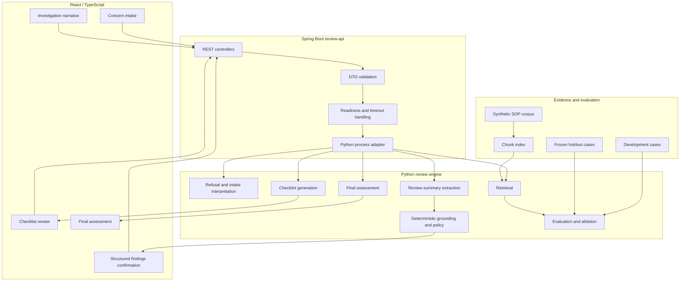

# Compounding Quality RAG

Synthetic, local-first, human-in-the-loop review-support system for compounding-quality inquiries.

> **Status:** The Python review engine, Spring Boot API, and React/TypeScript review workflow are implemented end to end. Retrieval now supports raw, deterministic-expansion, rule-intent, and GPT-5 Nano semantic-intent query strategies over the keyword retriever. The next milestone is operational hardening: CI, Docker Compose, structured logging, readiness verification, environment configuration, and an operations runbook.

## 1. Problem Statement

Technical Services pharmacists review compounding-related quality signals from workflows such as:

- frontline compounding quality-related events and general questions;
- negative customer reviews involving compounded products;
- suspected adverse events;
- beyond-use-date and stability questions;
- device, quantity, appearance, storage, ingredient, supplier, and efficacy concerns.

These workflows require repeated document lookup, categorization, missing-information analysis, record-review framing, escalation checks, and human judgment.

**Compounding Quality RAG** surfaces relevant synthetic SOP-like guidance, organizes missing information, preserves evidence citations, proposes structured findings, and supports a consistent pharmacist review workflow.

It does **not** make final clinical, legal, quality, or customer-resolution decisions.

## 2. Synthetic Data Boundary

This public repository uses synthetic SOP-like documents, sample concerns, investigation narratives, and hand-written evaluation labels.

It does **not** contain real or altered customer, patient, veterinarian, prescription, order, compounding-record, inventory, internal SOP, licensed drug-reference, or proprietary operational data.

The public system does not access real systems. Any internal deployment would require explicit governance, access control, privacy and security review, auditability, and human-review boundaries.

## 3. Current Project Shape

```text
React / TypeScript review UI
  owns the human-review workflow, readiness display, concern intake,
  checklist presentation, pharmacist narrative entry, extracted findings,
  structured confirmation, evidence display, and final assessment.

Spring Boot review-api
  owns HTTP routes, request validation, DTOs, orchestration, readiness,
  timeout handling, Python process lifecycle, error translation,
  and future authentication and audit.

Python review engine
  owns refusal behavior, retrieval, query interpretation, checklist generation,
  review-summary extraction, deterministic grounding, review policy,
  final assessment, evaluation, and ablation.
```

Current implemented layers:

| Layer | Status | Notes |
|---|---|---|
| Python review engine | Implemented | Retrieval, semantic-intent query strategies, checklist generation, extraction, grounding, final assessment, refusal behavior, evaluation, and JSON process bridge. |
| Spring Boot API | Implemented | Health, readiness, checklist, retrieval, review-summary extraction, final assessment, validation, orchestration, Python subprocess integration, and error translation. |
| React/TypeScript UI | Implemented | Human-in-the-loop concern → checklist → investigation narrative → extraction → confirmation → final-assessment workflow. |
| Retrieval evaluation | Implemented | Raw, deterministic expansion, rule intent, Nano intent, keyword, embedding, and hybrid comparison paths. |
| CI/Docker/runbook | Next | Add polyglot CI, Docker Compose, structured logs, smoke tests, environment configuration, and operational documentation. |

## 4. Human Review Workflow


The pharmacist remains in control of the structured findings before the final assessment is generated.

## 5. System Architecture



Python remains the owner of working RAG and domain behavior. Spring provides the stable service boundary around it rather than rewriting the same logic in Java.

## 6. API Surface

The Spring Boot service exposes:

```http
GET  /health
GET  /ready
POST /api/checklist
POST /api/retrieve
POST /api/review-summary/extract
POST /api/final-assessment
```

`GET /ready` verifies:

- Spring Boot availability;
- the configured Python command;
- the Python working directory;
- corpus and index availability.

The React UI displays backend readiness and disables workflow submission while the backend is unavailable.

## 7. Retrieval Architecture

The current retrieval-intent path is:

```text
complaint text
→ semantic intent detector
→ deterministic workflow-policy derivation
→ deterministic corpus vocabulary mapping
→ keyword retrieval
```

Supported query strategies:

- `raw`
- `deterministic_expansion`
- `rule_intent`
- `nano_intent`

`rule_intent` and `nano_intent` both produce semantic facts only.

Deterministic code owns workflow consequences such as:

- quality review;
- trend review;
- adverse-event review;
- pharmacist outreach;
- disclosure boundaries;
- public-corpus boundaries;
- reference review;
- reference boundaries.

Successful Nano predictions may be cached. Rule fallback output is not cached under Nano's model identity.

## 8. Retrieval Evaluation Results

### Controlled intent challenge

Dataset: `data/eval/retrieval_intent_challenge.json`  
Questions: `14`  
Top K: `5`

| Strategy | Hit rate@5 | MRR | Negative pass |
|---|---:|---:|---:|
| Raw | 0.714 | 0.679 | 0.786 |
| Deterministic expansion | 0.714 | 0.643 | 0.786 |
| Rule intent | 1.000 | 1.000 | 1.000 |

Rule intent also achieved:

- semantic micro precision: `1.000`;
- semantic micro recall: `1.000`;
- semantic exact match: `1.000`;
- derived-intent micro precision: `1.000`;
- derived-intent micro recall: `1.000`;
- derived-intent exact match: `1.000`.

This is a targeted challenge result, not a production-accuracy claim.

### Development retrieval evaluation

Dataset: `data/eval/retrieval_questions_development.json`  
Questions: `20`  
Top K: `5`

| Strategy | Hit rate@5 | MRR | Negative pass |
|---|---:|---:|---:|
| Raw | 0.700 | 0.563 | 0.850 |
| Deterministic expansion | 1.000 | 0.804 | 0.900 |
| Rule intent | 1.000 | 0.950 | 1.000 |
| Nano intent | 0.900 | 0.900 | 1.000 |

The final development-only rule repair added `ask about` and `asks about` to the information-request vocabulary while preserving the separate supplier/source-language requirement.

Recorded uncached runtime:

- rule intent: approximately `0.026` seconds total;
- Nano intent: approximately `116.648` seconds for 20 calls.

### Frozen holdout retrieval evaluation

Dataset: `data/eval/retrieval_questions_holdout.json`  
Questions: `20`  
Top K: `5`

| Strategy | Hit rate@5 | MRR | Negative pass |
|---|---:|---:|---:|
| Raw | 0.700 | 0.567 | 0.850 |
| Deterministic expansion | 0.850 | 0.733 | 0.850 |
| Rule intent | 0.750 | 0.725 | 0.900 |
| Nano intent | 0.950 | 0.950 | 1.000 |

Nano intent:

- missed one holdout question;
- returned no forbidden sources;
- used 20 model calls;
- had no fallbacks;
- had no structured-output failures;
- had no model errors;
- had no unknown tags;
- had no unmapped tags;
- took approximately `103.361` seconds uncached.

The frozen holdout establishes Nano as the strongest measured generalization path for the current corpus and evaluation. Rule intent remains the fast deterministic fallback.

## 9. Runtime Recommendation

Accuracy-oriented path:

```text
successful Nano semantic intent
→ deterministic workflow policy
→ shared vocabulary mapper
→ keyword retrieval
→ cache successful semantic intent
```

Failure path:

```text
Nano timeout, invalid output, unknown tag, or model error
→ rule semantic detector
→ deterministic workflow policy
→ shared vocabulary mapper
→ keyword retrieval
```

Fallback output must not be cached as Nano output.

## 10. Repository Structure

```text
apps/review-ui/
  React and TypeScript human-review application.

rag-engine-python/
  app/
    api_runner.py
    checklist.py
    final_assessment.py
    holdout_evaluate.py
    retrieval.py
    retrieval_ablation.py
    retrieval_evaluate.py
    retrieval_intent.py
    retrieval_query_strategy.py
    review_summary_extraction.py
    schemas.py
  data/
    corpus/
    eval/
    index/
  docs/
  tests/

services/review-api/
  Spring Boot API and Python process integration.
```

## 11. Run Locally

### Python

```powershell
cd rag-engine-python
uv sync --dev
uv run python -m app.ingestion
uv run pytest
uv run mypy app tests
uv run pyright app tests
uv run ruff check .
```

### Spring Boot

```powershell
cd services/review-api
.\gradlew.bat test
.\gradlew.bat bootRun
```

### React

```powershell
cd apps/review-ui
npm ci
npm test
npm run build
npm run dev
```

## 12. Retrieval Evaluation Commands

Challenge:

```powershell
uv run python -m app.holdout_evaluate retrieval-ablation `
  --questions data/eval/retrieval_intent_challenge.json `
  --strategies raw,deterministic_expansion,rule_intent `
  --run-id retrieval-intent-challenge-local
```

Development:

```powershell
uv run python -m app.holdout_evaluate retrieval-ablation `
  --questions data/eval/retrieval_questions_development.json `
  --strategies raw,deterministic_expansion,rule_intent,nano_intent `
  --run-id retrieval-intent-development-v4 `
  --refresh-nano
```

Frozen holdout:

```powershell
uv run python -m app.holdout_evaluate retrieval-ablation `
  --questions data/eval/retrieval_questions_holdout.json `
  --strategies raw,deterministic_expansion,rule_intent,nano_intent `
  --run-id retrieval-intent-holdout-v4 `
  --refresh-nano
```

## 13. Optional LLM Configuration

```powershell
$env:OPENAI_API_KEY="..."
$env:OPENAI_MODEL="gpt-5-nano"
```

The LLM proposes structured interpretation. Pydantic validation, deterministic grounding, deterministic workflow policy, and pharmacist confirmation remain in control of downstream behavior.

## 14. Validation

The current Python repository state passed:

```text
342 tests
mypy: no issues
Pyright: 0 errors
Ruff: clean
git diff --check: clean
```

## 15. Safety and Product Boundaries

- The system is read-only.
- It does not mutate source records.
- It does not replace pharmacist review.
- It does not access real compounding records, inventory, customer history, patient records, order pages, internal systems, or licensed external references.
- Synthetic SOP-like documents support process guidance only.
- Structured severe triggers drive final escalation routing.
- Human pharmacist review remains the final decision point.
- Numeric model confidence is not displayed because it has not been calibrated.

## 16. Current Limitations

| Limitation | Impact |
|---|---|
| Small synthetic corpus | Retrieval results do not establish production performance. |
| Small frozen holdout | The `0.95` Nano result is promising but not a broad accuracy estimate. |
| Nano latency | Uncached model calls were approximately five seconds each in the recorded holdout run. |
| External model dependency | Nano requires API availability, cost control, timeout handling, caching, and deterministic fallback. |
| No production operations layer yet | CI, containers, structured logs, smoke tests, and runbook remain to be added. |
| No persistent audit store yet | Evaluation artifacts are file-based and runtime workflow state is not persisted. |

## 17. Holdout Policy

The v4 holdout result is the frozen generalization baseline.

Future changes may use its failures for development, but after that happens the dataset becomes a regression benchmark rather than an unbiased holdout. New generalization claims require a new untouched holdout.

## 18. Next Engineering Milestone

Retrieval experimentation is closed for the current product milestone.

Next:

1. add GitHub Actions for Python, Spring Boot, React, and repository checks;
2. add Docker Compose for the UI and Spring/Python backend boundary;
3. add structured logs with request IDs, operation, duration, model, cache, fallback, and bounded error fields;
4. add health and readiness smoke tests;
5. add `.env.example`;
6. add an operations runbook;
7. verify the complete demo and refusal path in containers.

Further Nano optimization belongs in a later performance milestone.

## 19. Interview Framing

> I built a production-shaped, human-in-the-loop AI review system for compounding-quality inquiries using synthetic data. React owns the pharmacist workflow, Spring Boot owns the stable HTTP and orchestration boundary, and Python owns retrieval, extraction, deterministic grounding, and review policy. I evaluated raw, deterministic, rule-based semantic, and GPT-5 Nano semantic query strategies under controlled conditions. Nano generalized best on the frozen holdout, while the rule detector remained a fast deterministic fallback. The next step is operational hardening with CI, containers, structured logs, and a runbook.

## 20. What This Is Not

This is not a production pharmacy system.

It does not access live systems, make final clinical determinations, replace pharmacist judgment, promise customer resolutions, or use proprietary records.
