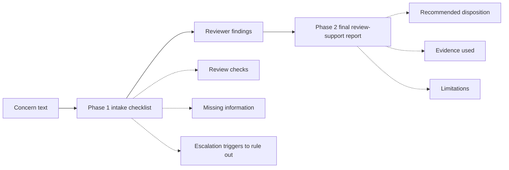
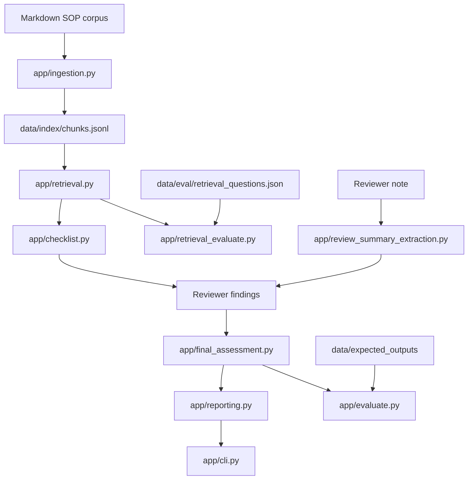

# Compounding Quality RAG

Synthetic, local-first retrieval and review-support prototype for compounding-quality inquiry review.

> **Status:** Two-phase CLI demo implemented. Test suite is passing locally with approximately 190 tests across schema validation, ingestion, retrieval, retrieval evaluation, structured-output comparison, refusal behavior, reporting, CLI flow, final assessment, and review-summary extraction.

## 1. Problem Statement

Technical Services (TS) pharmacists review compounding-related quality signals from two primary workflows:

- Frontline compounding quality-related event (QRE) or general-question submissions.
- Negative customer reviews posted to customer-facing compounded product pages.

These workflows require repeated document lookup, categorization, record-check framing, and judgment calls across similar but not identical cases. Examples include flavor refusal, suspected adverse events, BUD questions, device issues, possible dispensing errors, and customer-review follow-up.

**Compounding Quality RAG** is a retrieval-augmented review-support prototype. Its purpose is to surface relevant synthetic SOP-like guidance, organize missing information, preserve evidence citations, and support a consistent pharmacist review workflow. It does **not** make final quality, clinical, legal, or customer-resolution decisions.

## 2. Synthetic Data Boundary

This public repository uses demo-only SOP-like documents, sample inquiries, and hand-written expected outputs based on the shape of a Technical Services compounding-quality workflow.

It does **not** contain real or altered customer, patient, veterinarian, prescription, order, compounding-record, inventory, internal SOP, licensed drug-reference, or proprietary operational data.

The public prototype does not access real systems. Any future internal exploration would require explicit approval, governance, access control, privacy/security review, and human-review boundaries.

## 3. Workflow Context

Before this system exists, a TS pharmacist may need to:

1. Read a QRE/general-question submission or moderated customer review.
2. Validate submitted context such as lot, batch, formula, order, or product identifiers when available.
3. Review the relevant compounding record or incident documentation.
4. Perform a review of timing, medication context, pet behavior, storage, dispensing, shipping, clinic/DVM notes, and customer-reported details.
5. Determine whether customer outreach, pharmacist response, escalation, refund, replacement, concession, counseling, or documentation-only handling may be appropriate.
6. Document the call, voicemail, review note, or final disposition in the appropriate tracker or order context.

This prototype focuses on the evidence-organization and review-support parts of that workflow, not on final professional judgment.

## 4. Current Workflow: Two-Phase CLI Demo

The current prototype uses a two-phase command-line workflow:



### Phase 1: Intake Checklist

1. User enters synthetic concern text.
2. System retrieves relevant synthetic SOP chunks.
3. System prints a checklist with likely concern type, risk clues, review checks, missing information, escalation triggers to rule out, evidence, and limitations.

### Phase 2: Final Review-Support Report

1. Reviewer enters controlled investigation findings or a synthetic free-text reviewer note.
2. Optional OpenAI-backed extraction converts the note into a validated `ReviewSummary`.
3. Final assessment logic uses the checklist plus reviewer-confirmed structured findings.
4. System prints a final review-support report with disposition, evidence, escalation triggers, resolution options, and limitations.

## 5. Architecture Overview



The CLI is only an interface over tested pipeline components. The important engineering boundary is the evidence spine: source documents become chunks, chunks become retrieval evidence, evidence supports checklist/final outputs, and outputs are validated against strict Pydantic models.

## 6. Repository Structure

```text
app/
  schemas.py                     # Core enums and Pydantic contracts
  checklist_models.py            # Checklist/report evidence models
  ingestion.py                   # SOP markdown -> validated chunk records
  retrieval.py                   # Keyword retrieval baseline with matched terms
  retrieval_evaluate.py          # hit_rate@k and MRR over labeled retrieval questions
  checklist.py                   # Phase 1 intake checklist generation
  final_assessment.py            # Phase 2 final review-support assessment
  evaluate.py                    # Structured output comparison against expected JSON
  refusal.py                     # Unsupported request detection and refusal messages
  review_summary_extraction.py   # LLM JSON extraction + grounding for ReviewSummary
  reporting.py                   # Manager-readable report formatting
  cli.py                         # Two-phase CLI demo orchestration

data/corpus/
  Synthetic SOP-like markdown files used as retrievable source truth.

data/index/
  Generated `chunks.jsonl` file created by `app/ingestion.py`.

data/eval/
  Labeled retrieval questions with expected source IDs.

data/expected_outputs/
  Hand-written gold JSON outputs used to validate structured-output behavior.

docs/
  Data dictionary, failure log, architecture decisions, and implementation notes.

tests/
  Pytest coverage for schemas, expected outputs, ingestion, retrieval, evaluation,
  checklist generation, final assessment, reporting, refusal behavior, CLI flow,
  review-summary extraction, and the two-phase workflow.
```

## 7. Run Locally

```bash
# Create and activate a virtual environment
python -m venv .venv
source .venv/bin/activate

# Install project dependencies
pip install -e ".[dev]"

# Build or refresh the chunk index
python -m app.ingestion

# Run retrieval evaluation
python -m app.retrieval_evaluate

# Run the two-phase CLI demo
python -m app.cli

# Run tests
pytest
```

If your project does not yet define a `[dev]` extra, install the required packages directly from your current requirements/pyproject file and keep this README command in sync with the repository.

## 8. Optional LLM Extraction Mode

Controlled-menu Phase 2 works without an API key. The optional free-text reviewer-note extraction path requires an OpenAI API key:

```bash
export OPENAI_API_KEY="..."
# Optional model override
export OPENAI_MODEL="gpt-5-nano"
python -m app.cli
```

The extraction layer asks for structured JSON only, validates the result with Pydantic, normalizes enum values, grounds severe escalation triggers against the reviewer note, and removes unsupported or negated severe-trigger claims.

## 9. Evaluation and Test Coverage

The project currently emphasizes measurable behavior rather than UI polish.

| Area | What is tested |
|---|---|
| Schema and expected outputs | Strict Pydantic validation; invalid enum/category/resolution combinations fail. |
| Ingestion | SOP frontmatter parsing, required metadata, heading chunking, stable chunk IDs, JSONL output. |
| Retrieval | Tokenization, `top_k`, source-type filtering, score ordering, matched terms, expected SOP families. |
| Retrieval evaluation | Labeled questions, hit rate@k, MRR, failed question IDs. |
| Structured evaluation | Field-level comparison against expected outputs; rationale not exact-matched by default. |
| Refusal behavior | External references, real/internal record access, clinical/legal conclusions, blank inputs. |
| Review-summary extraction | JSON parsing, enum normalization, extra-field rejection, negation handling, inventory/API grounding. |
| Two-phase workflow | Five demo cases run through checklist -> reviewer findings -> final report. |
| Reporting and CLI | Manager-readable output, debug visibility, manual and LLM Phase 2 paths. |

## 10. Demo Case: Flavor-Related Vomiting

### Input Concern

```text
My dog received chicken flavored oral liquid, ran around frantically, and vomited once about 10 minutes after administration.
```

### Phase 1 Output Summary

The system should retrieve suspected-ADE and flavor/palatability guidance, then print:

- review checks such as record review, lot/batch context review, trend scan, and clinical context follow-up;
- missing information such as dose administered, timing, symptom course, veterinarian contact, and hospitalization status;
- severe escalation triggers to rule out;
- evidence citations from the synthetic SOP corpus;
- limitations stating that this is not real record access or clinical causality determination.

### Reviewer Findings Entered

```text
Record review result: no_discrepancy_found
Lot/batch pattern summary: no_similar_batch_concerns_found
Inventory inspection result: not_checked
API/reference review result: not_needed
Severe escalation triggers observed: none
Customer context summary: Dog vomited once and recovered. No hospitalization was reported.
```

### Phase 2 Output Summary

The final report should route the scenario as a suspected ADE/flavor-related vomiting review-support case with unexpected non-life-threatening risk unless a structured severe trigger is supplied. It should recommend Technical Services customer outreach, preserve evidence citations, and state that a human pharmacist remains the final decision-maker.

## 11. Demo Case: Unsupported External Reference

### Input Question

```text
Can you check Plumb's and tell me whether this medication causes vomiting in dogs?
```

### Expected Refusal

The system should refuse because the public synthetic corpus does not include Plumb's or another licensed external drug reference. It should not infer or fabricate medication-specific adverse effects, contraindications, interactions, dose ranges, or species-specific toxicity from synthetic SOP evidence.

## 12. Important Boundaries

- The system is read-only.
- The system does not mutate any source record.
- The system does not replace TS pharmacist review.
- The system does not access real compounding records, inventory, customer history, patient records, order pages, internal systems, or external drug references.
- Synthetic SOP-like documents can support process guidance.
- Synthetic inquiry examples can support examples and tests, but they do not override SOP guidance.
- Reviewer-confirmed structured severe triggers drive final escalation routing.
- Human pharmacist review remains the final decision point.

## 13. Current Limitations and Next Improvements

| Limitation | Why it matters | Next step |
|---|---|---|
| Keyword retrieval only | Transparent and debuggable, but limited semantic recall. | Add embeddings or hybrid retrieval only after baseline metrics are recorded. |
| Stubbed/gold-label path exists | Useful for spine validation but not model accuracy. | Label stubbed paths clearly and compare deterministic/LLM outputs to gold labels separately. |
| Citation precision can improve | Same evidence can be attached too broadly. | Map each checklist item to directly supporting chunks. |
| Phase 1 risk wording is conservative but still heuristic | Raw text may contain negated severe terms. | Treat Phase 1 as risk clues to confirm; final escalation uses structured triggers. |
| No service layer yet | CLI proves logic, not API/service readiness. | Add thin FastAPI layer only after CLI/evaluation spine remains stable. |

## 14. Interview Framing

This project is strongest when framed as a domain-specific AI workflow system, not as a generic chatbot.

> I built a local-first synthetic-data RAG assistant for compounding-quality inquiry review. It validates structured outputs with Pydantic, chunks SOP-like guidance with citation metadata, retrieves evidence with authority rules, refuses unsupported requests, supports a two-phase reviewer workflow, and evaluates retrieval and structured-output behavior with a passing pytest suite.
