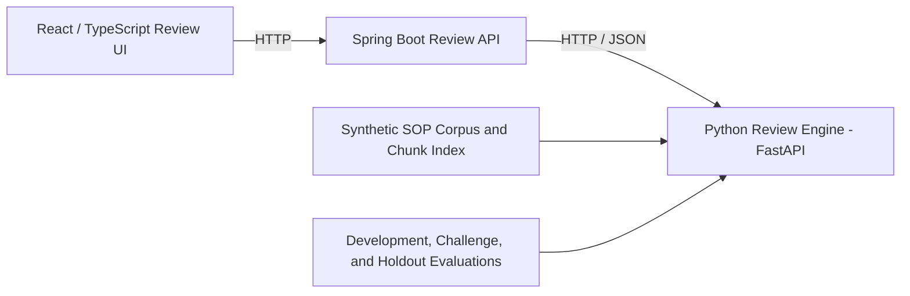
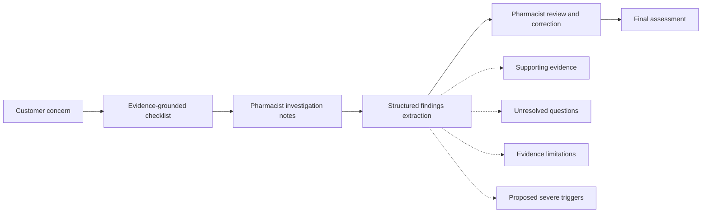

# Compounding Quality RAG

[](https://react.dev/)
[](https://www.typescriptlang.org/)
[](https://spring.io/projects/spring-boot)
[](https://openjdk.org/)
[](https://www.python.org/)
[](https://docs.pydantic.dev/)
[](https://vite.dev/)


A synthetic, local-first, human-in-the-loop review-support system for compounding-quality inquiries.

> **Current status:** The Python review engine, Spring Boot API, and React/TypeScript review workflow are implemented end to end and run as containerized services over HTTP through Docker Compose. The UI workflow has been rebuilt around a denser human-review path with retrieved evidence, readable labels, accordion-style workflow state, and final-assessment detail disclosure. Semantic-intent retrieval evaluation is closed for the current product milestone. GPT-5 Nano extraction latency has been reduced from roughly 14 seconds to roughly 1.3–2.6 seconds for the measured path through minimal reasoning, output caps, and client reuse. Request correlation now propagates from Spring MDC to the Python engine through `X-Request-Id`, appears in API error responses, is returned in response headers, and is logged by the Python FastAPI service. Remaining operational hardening covers CI, container smoke tests, `.env.example`, an operations runbook, and broader structured operation fields beyond request correlation.

## Problem Statement

Technical Services pharmacists review compounding-related quality signals from workflows such as:

- frontline quality-related event and general-question submissions;
- negative customer reviews involving compounded products;
- suspected adverse events;
- beyond-use-date and stability questions;
- device, quantity, appearance, storage, ingredient, supplier, and efficacy concerns.

These cases require repeated document lookup, categorization, missing-information analysis, review-scope determination, escalation screening, and professional judgment.

**Compounding Quality RAG** supports that work by:

- retrieving relevant synthetic SOP-like guidance;
- organizing missing information and review checks;
- extracting structured findings from pharmacist investigation notes;
- preserving evidence citations and limitations;
- supporting a consistent, reviewable path to a final assessment.

The system does **not** make final clinical, legal, quality, or customer-resolution decisions.

## Synthetic Data and Safety Boundary

This public repository uses only synthetic SOP-like documents, sample concerns, investigation narratives, and adjudicated evaluation labels.

It does **not** contain real or altered customer, patient, veterinarian, prescription, order, compounding-record, inventory, internal SOP, licensed drug-reference, or proprietary operational data.

The public system does not access live systems. Any internal deployment would require explicit governance, access control, privacy and security review, auditability, approved data handling, and human-review controls.

## System Architecture

| Layer | Primary responsibility |
|---|---|
| **React/TypeScript Review UI** | Provides the pharmacist-facing workflow for concern intake, checklist review, retrieved-evidence inspection, investigation-note entry, extracted findings, unresolved questions, structured confirmation, final-assessment presentation, and expanded pipeline detail review. |
| **Spring Boot Review API** | Provides the service boundary for REST endpoints, request and response DTOs, validation, orchestration, readiness checks, timeout management, HTTP integration with the Python review engine, request correlation, API error responses, OpenAPI documentation, and future authentication and audit controls. |
| **Python Review Engine (FastAPI)** | Standalone HTTP service that owns ingestion, chunking, retrieval, semantic-intent detection, LLM-assisted extraction, deterministic grounding, refusal behavior, checklist generation, final-assessment logic, evaluation, and Python-side request-correlation logging. |



Python remains the owner of working RAG and domain behavior. Spring Boot provides a stable application boundary around that logic over HTTP rather than duplicating it in Java, so each service starts, fails, and is health-checked independently.

## Recent Engineering History

The current architecture reflects a sequence of completed milestones:

| Milestone | What changed | Current result |
|---|---|---|
| HTTP/containerized stack | Replaced the old per-request Python subprocess bridge with a standalone FastAPI engine called by Spring Boot over HTTP. Added Docker Compose with health-gated startup for the UI, API, and engine. | The full stack runs locally as separate services with explicit HTTP boundaries and independent health checks. |
| Architecture documentation update | Reconciled README and design docs with the HTTP/containerized runtime and retained the keyword, embedding, and hybrid retriever baselines. | Documentation no longer frames the live Spring-to-Python bridge as stdin/stdout subprocess orchestration. |
| LLM latency pass | Added minimal reasoning, max output tokens, and cached OpenAI client construction for the review-summary extraction path. | The measured extraction path dropped from about 14 seconds to about 1.3–2.6 seconds while preserving valid structured output. |
| Review UI workflow overhaul | Added a retrieved-evidence panel, human-friendly enum labels, accordion-style workflow sections, full pipeline output disclosure, and restored component test execution. | The UI is closer to an interview-demo workflow: denser, more reviewable, and better aligned with human-in-the-loop decision boundaries. |
| Request correlation | Added Spring request-ID lifecycle management, MDC propagation, API error response/request header exposure, downstream `X-Request-Id` forwarding, Python logging, and a stderr smoke check. | One request can be followed across Spring logs, Spring error responses, the downstream Python request, and Python stderr. |

## Request Correlation and Operational Visibility

Request correlation is implemented as a narrow cross-service concern, not as a custom observability framework:

```text
incoming request
→ Spring RequestCorrelationFilter
→ request attribute + MDC requestId + X-Request-Id response header
→ Spring log pattern / ApiErrorResponse.requestId
→ HttpRagEngineClient forwards X-Request-Id
→ Python FastAPI middleware logs and echoes X-Request-Id
→ smoke_request_correlation.sh verifies the ID appears in Python stderr
```

The current implementation proves request-level traceability across the Spring and Python boundary. Broader structured operation logging is still a separate follow-up: operation names, durations, model name, cache status, fallback path, bounded error codes, and container-level readiness smoke tests.

## End-to-End Review Workflow



Workflow behavior:

1. The pharmacist submits a synthetic concern.
2. Deterministic refusal checks run before retrieval.
3. The system identifies information already present and retrieves relevant synthetic evidence.
4. The UI presents an investigation checklist, missing information, review checks, and limitations.
5. The pharmacist enters an investigation narrative.
6. The Python engine extracts a structured review summary and grounds it against the narrative.
7. The pharmacist reviews and corrects the proposed findings.
8. The system generates a final review-support assessment from the confirmed structured findings.

Final escalation depends on reviewer-confirmed structured triggers, not raw keyword matching alone.

## Retrieval Architecture

The current query-interpretation pipeline is:

```text
complaint text
→ semantic intent detection
→ deterministic workflow-policy derivation
→ deterministic corpus-vocabulary mapping
→ keyword retrieval
```

Supported query strategies:

- `raw`
- `deterministic_expansion`
- `rule_intent`
- `nano_intent`

`rule_intent` and `nano_intent` produce semantic facts only. Deterministic code owns workflow consequences such as:

- quality review;
- trend review;
- adverse-event review;
- pharmacist outreach;
- disclosure boundaries;
- public-corpus boundaries;
- reference review;
- reference boundaries.

Successful Nano predictions may be cached. Rule fallback output is not cached under Nano's model identity.

## Retrieval Evaluation Results

All comparisons below use the same corpus, chunks, keyword retriever, scoring, source labels, and `top_k=5`. Only query interpretation and construction change.

| Dataset | Questions | Strategy | Hit rate@5 | MRR | Negative-constraint pass |
|---|---:|---|---:|---:|---:|
| Controlled intent challenge | 14 | Raw | 0.714 | 0.679 | 0.786 |
| Controlled intent challenge | 14 | Deterministic expansion | 0.714 | 0.643 | 0.786 |
| Controlled intent challenge | 14 | **Rule intent** | **1.000** | **1.000** | **1.000** |
| Development set | 20 | Raw | 0.700 | 0.563 | 0.850 |
| Development set | 20 | Deterministic expansion | 1.000 | 0.804 | 0.900 |
| Development set | 20 | **Rule intent** | **1.000** | **0.950** | **1.000** |
| Development set | 20 | Nano intent | 0.900 | 0.900 | 1.000 |
| Frozen holdout | 20 | Raw | 0.700 | 0.567 | 0.850 |
| Frozen holdout | 20 | Deterministic expansion | 0.850 | 0.733 | 0.850 |
| Frozen holdout | 20 | Rule intent | 0.750 | 0.725 | 0.900 |
| Frozen holdout | 20 | **Nano intent** | **0.950** | **0.950** | **1.000** |

Additional findings:

- Rule intent achieved `1.000` semantic precision, recall, and exact match on the controlled challenge.
- Rule intent also achieved `1.000` derived-intent precision, recall, and exact match on the controlled challenge.
- Nano intent produced the strongest frozen-holdout retrieval performance.
- Rule intent remains the low-latency deterministic fallback.
- The recorded frozen-holdout Nano run completed 20 uncached model calls in approximately `103.361` seconds.

The frozen holdout is the current generalization baseline. Once future changes are designed using its failures, it should be treated as a regression benchmark rather than an untouched holdout.

### Retriever comparison baselines

Separate from query interpretation, the engine keeps three interchangeable retrievers behind a common `Retriever` protocol, compared on the synthetic evaluation set in `rag-engine-python/reports/retrieval_comparison.md`:

| Retriever | Hit rate@5 | MRR | Notes |
|---|---:|---:|---|
| Keyword | 0.833 | 0.750 | Transparent, auditable baseline; the default checklist/retrieval path. |
| Embedding | 0.917 | 0.812 | Local deterministic hashing-vector plumbing — not production semantic search. |
| Hybrid | 0.833 | 0.750 | Normalized keyword (`0.65`) + vector (`0.35`) combination. |

These baselines exist to measure retrieval tradeoffs with evidence before any claim that vector or hybrid retrieval is generally superior. No external embedding model or vector database is used yet.

## Repository Structure

```text
apps/review-ui/
  React/TypeScript pharmacist review application.
  Supports concern intake, checklist review, investigation-note entry,
  extracted findings, evidence review, unresolved questions,
  structured confirmation, and final-assessment display.

services/review-api/
  Spring Boot service boundary around the Python review engine.
  Provides health and readiness checks, checklist generation, retrieval,
  review-summary extraction, final assessment, request validation,
  orchestration, HTTP integration with the Python engine, timeout handling,
  and API error translation. Dockerfile.review-api builds a Temurin image.

rag-engine-python/
  app/
    schemas.py
      Canonical enums, Pydantic models, and application contracts.

    checklist_models.py
      Checklist, evidence, and review-report models.

    ingestion.py
      Synthetic SOP markdown ingestion and validated chunk generation.

    retrieval.py
      Keyword retrieval implementation and matched-term evidence.

    retrieval_intent.py
      Rule-based and Nano semantic-intent detection.

    retrieval_query_strategy.py
      Query construction, semantic-intent caching, and fallback behavior.

    retrieval_evaluate.py
      Retrieval metrics over labeled evaluation questions.

    retrieval_ablation.py
      Controlled query-strategy comparison and diagnostics.

    retrieval_embedding.py
      Local deterministic hashing-vector embedding retriever baseline.

    retrieval_hybrid.py
      Hybrid retriever combining normalized keyword and vector scores.

    retrieval_compare.py
      Side-by-side keyword/embedding/hybrid retriever comparison.

    holdout_evaluate.py
      Development, challenge, and frozen-holdout orchestration.

    checklist.py
      Evidence-grounded investigation checklist generation.

    extract_intake_understanding.py
      Structured extraction of facts already present in a concern.

    review_summary_extraction.py
      LLM-assisted finding extraction and deterministic grounding.

    final_assessment.py
      Final review-support assessment and disposition logic.

    evaluate.py
      Structured-output comparison against adjudicated expectations.

    refusal.py
      Unsupported-request detection and refusal responses.

    reporting.py
      Human-readable report formatting.

    cli.py
      Local command-line demonstration workflow.

    server.py
      FastAPI HTTP service exposing the review engine to Spring Boot.

    api_runner.py
      Legacy JSON stdin/stdout runner (superseded by server.py as the
      Spring Boot bridge; retained for local/CLI use).

  data/
    corpus/
      Synthetic SOP-like source documents.

    index/
      Generated retrieval index.

    eval/
      Development, challenge, and frozen-holdout datasets with expected
      and forbidden source labels.

    expected_outputs/
      Adjudicated structured outputs used for behavioral evaluation.

  reports/
    Generated retrieval comparison report (keyword/embedding/hybrid).

  docs/
    Architecture decisions, evaluation design, failure analysis,
    retrieval experiments, domain policy, and implementation guidance.

  tests/
    Pytest coverage for schemas, ingestion, retrieval, semantic intent,
    query construction, caching, evaluation, checklist generation,
    extraction, deterministic grounding, final assessment, refusal behavior,
    reporting, CLI behavior, and the Spring-to-Python HTTP contract.

infra/
  docker-compose.yml
    Builds and runs review-ui, review-api, and rag-engine with
    health-gated startup over a shared Docker network. Each service has a
    Dockerfile.<service> at its package root.
```

## Running the Project

### Full stack with Docker Compose (recommended)

Provide the engine's OpenAI key in `rag-engine-python/secrets.env` (gitignored):

```text
OPENAI_API_KEY=sk-...
OPENAI_MODEL=gpt-5-nano
```

Then build and start all three services:

```powershell
docker compose -f infra/docker-compose.yml up --build
```

This brings up the Python engine, Spring Boot API, and React UI with
health-gated startup. Open the UI at http://localhost:5173; it proxies `/api`,
`/health`, and `/ready` to the API, which calls the engine over HTTP.

### Python review engine

```powershell
cd rag-engine-python
uv sync --dev
uv run python -m app.ingestion
uv run pytest
uv run mypy app tests
uv run pyright app tests
uv run ruff check .
```

### Spring Boot API

```powershell
cd services/review-api
.\gradlew.bat test
.\gradlew.bat bootRun
```

For a local (non-Compose) run, point the API at a locally running engine with
`PYTHON_ENGINE_BASE_URL` (defaults to `http://localhost:8000`).

### React/TypeScript UI

```powershell
cd apps/review-ui
npm ci
npm test
npm run build
npm run dev
```

## Retrieval Evaluation Commands

Controlled challenge:

```powershell
uv run python -m app.holdout_evaluate retrieval-ablation `
  --questions data/eval/retrieval_intent_challenge.json `
  --strategies raw,deterministic_expansion,rule_intent `
  --run-id retrieval-intent-challenge-local
```

Development comparison:

```powershell
uv run python -m app.holdout_evaluate retrieval-ablation `
  --questions data/eval/retrieval_questions_development.json `
  --strategies raw,deterministic_expansion,rule_intent,nano_intent `
  --run-id retrieval-intent-development-v4 `
  --refresh-nano
```

Frozen holdout:

```powershell
uv run python -m app.holdout_evaluate retrieval-ablation `
  --questions data/eval/retrieval_questions_holdout.json `
  --strategies raw,deterministic_expansion,rule_intent,nano_intent `
  --run-id retrieval-intent-holdout-v4 `
  --refresh-nano
```

## Optional OpenAI Configuration

```powershell
$env:OPENAI_API_KEY="..."
$env:OPENAI_MODEL="gpt-5-nano"
```

Under Docker Compose the engine reads these from the gitignored `rag-engine-python/secrets.env` via `env_file`, so no key is baked into any image.

The model proposes structured interpretation. Pydantic validation, deterministic grounding, deterministic workflow policy, and pharmacist confirmation remain authoritative downstream controls.

## Validation Coverage

| Area | What is verified |
|---|---|
| Schemas and contracts | Strict Pydantic validation, enum normalization, and invalid-combination rejection. |
| Ingestion | Frontmatter parsing, required metadata, heading chunking, stable chunk IDs, and JSONL output. |
| Retrieval | Tokenization, ranking, source filtering, matched terms, expected sources, and forbidden sources. |
| Semantic intent | Rule and Nano semantic tags, workflow derivation, query mapping, fallback behavior, and cache provenance. |
| Review-summary extraction | JSON parsing, deterministic grounding, negation handling, evidence mapping, and unresolved questions. |
| Checklist and final assessment | Review checks, missing information, severe-trigger handling, disposition logic, evidence, and limitations. |
| Refusal behavior | External references, real/internal record access, clinical or legal conclusions, and blank inputs. |
| Spring Boot API | Validation, orchestration, process integration, timeouts, readiness, and API error translation. |
| React workflow | Concern intake, loading/error states, checklist display, extraction, structured confirmation, and final assessment. |

Current validation snapshots recorded in recent milestone work:

```text
Python review engine: 342 tests passed; mypy clean; Pyright clean; Ruff clean; git diff --check clean
Review UI workflow: 44 Vitest tests passed; TypeScript check clean; Vite build clean
Targeted schema/assessment checks during UI overhaul: 21 passing
LLM client latency tests: 11 passing
Downstream extraction/intent suites during latency pass: 26 passing
```

These counts are milestone snapshots, not a substitute for the upcoming repository-wide CI gates.

## Important Boundaries

- The system is read-only.
- It does not mutate source records.
- It does not replace pharmacist review.
- It does not access real compounding records, inventory, customer history, patient records, order pages, internal systems, or licensed external references.
- Synthetic SOP-like documents support process guidance only.
- Reviewer-confirmed structured severe triggers drive final escalation routing.
- Human pharmacist review remains the final decision point.
- Numeric model confidence is not displayed because it has not been calibrated.

## Current Limitations

| Limitation | Impact | Planned response |
|---|---|---|
| Small synthetic corpus and evaluation sets | Results do not establish production performance. | Expand only with governed, adjudicated synthetic or approved data. |
| Nano latency and external dependency | The extraction path is materially faster after the latency pass, but Nano still adds API cost, timeout, availability, and model-behavior risk. | Keep further Nano optimization in a later performance milestone; measure cached/uncached latency and cost before changing prompts or model settings again. |
| Citation precision | A retrieved source may still support multiple outputs too broadly. | Tighten item-level evidence mapping. |
| Operations hardening is incomplete | Containers, health-gated startup, and request correlation exist, but repository-wide CI, container smoke tests, runbook coverage, and broader structured operation fields are not complete. | Add CI, container smoke tests, `.env.example`, a runbook, and operation-level structured log fields beyond request IDs. |
| No persistent audit store | Evaluation artifacts are file-based and workflow state is not persisted. | Add persistence only when a concrete audit or evaluation use case requires it. |

## Next Engineering Milestone

Retrieval experimentation is closed for the current product milestone. The Spring-to-Python boundary is now HTTP, the three-service stack runs under Docker Compose with health-gated startup, the review UI workflow has been rebuilt for human review, the LLM extraction path has had a focused latency pass, and request correlation now crosses the Spring/Python boundary.

Next work should be operational closeout, not more retrieval experimentation or UI expansion:

1. add GitHub Actions for Python, Spring Boot, React, and repository hygiene checks;
2. add container smoke tests that exercise `/health`, `/ready`, and one API-to-engine request against the running Docker Compose stack;
3. add `.env.example` documenting required and optional runtime variables without exposing secrets;
4. add an operations runbook covering startup, readiness failure, Python-engine outage, OpenAI-key/config failure, slow extraction, retrieval returning no evidence, and request-ID-based debugging;
5. expand structured operation logs beyond request correlation with operation name, duration, model, cache status, fallback path, bounded error code, and downstream status.

Do **not** reopen retrieval experiments unless a concrete product failure or regression requires it. Do **not** start persistence until there is a specific audit/evaluation use case. Further Nano optimization belongs in a later performance milestone after CI and operational smoke coverage are in place.

## Interview Framing

> I built a production-shaped, human-in-the-loop AI review system for compounding-quality inquiries using synthetic data. React provides the pharmacist-facing review workflow, Spring Boot provides the HTTP service and orchestration boundary, and Python owns retrieval, extraction, deterministic grounding, and review policy. I migrated the Spring-to-Python integration from a subprocess bridge to an HTTP FastAPI service, containerized the UI/API/engine stack with Docker Compose health-gated startup, rebuilt the UI around evidence review and pharmacist confirmation, evaluated multiple retrieval-query strategies, and added request correlation across Spring logs, API error responses, downstream Python calls, and Python stderr. GPT-5 Nano generalized best on the frozen retrieval holdout, while the rule detector remains the fast deterministic fallback.

## What This Is Not

This is not a production pharmacy system.

It does not access live systems, make final clinical determinations, replace pharmacist judgment, promise customer resolutions, or use proprietary records.
