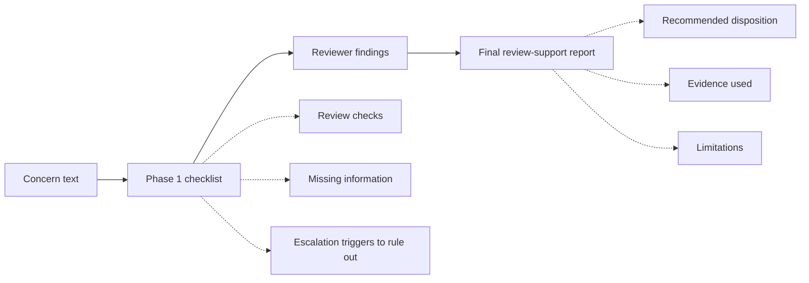
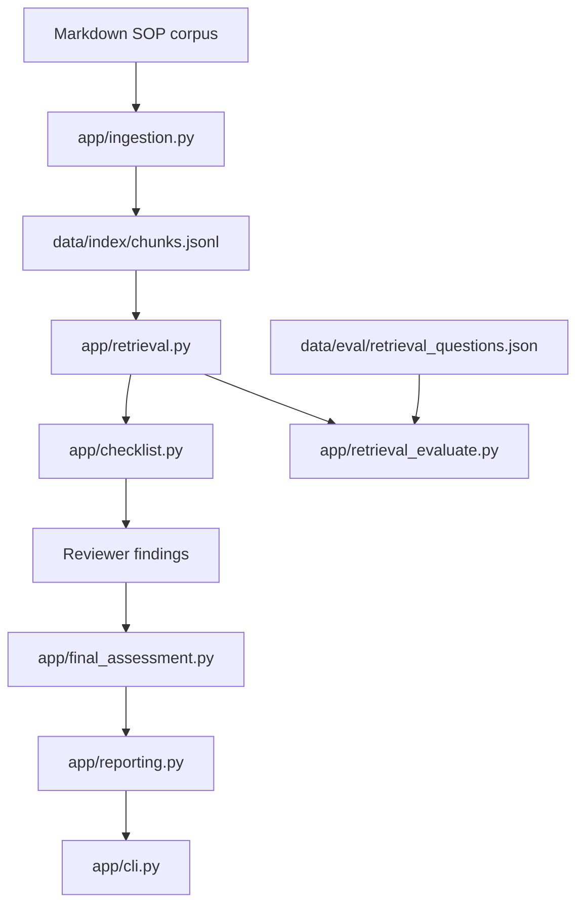

# Compounding-Quality-RAG

## 1. Problem Statement
Technical Services (TS) pharmacists review compounding-related quality signals from two primary workflows:
- Frontline compounding quality related event (QRE) submissions
- Negative customer reviews posted to the customer facing product page
These workflows require repeated document lookup, categorization, and judgment calls across similar but not identical cases, such as formula changes and compounding record review. 

Compounding-Quality-RAG is a retrieval-augmented-generation prototype designed to reduce mechanical review time by retrieving the most relevant ingredient records, SOPs, formula changes, and historical examples for a TS pharmacist. The system is not intended to make final quality or clinical decisions. It's purpose is to surface evidence, summarize context, and support consistent pharmacist review.

## 2. Workflow Context (“What does a TS pharmacist actually do step-by-step before this system exists?”)
A TS pharmacist's review starts with a QRE form submission or a moderated customer review gets posted to the website for a compounded prescription product.
1. First, read the review or QRE submission text.
2. Validate submitted information is correct, such as lot number, CID, order number.
3. Review the compounding record of the associated lot and document incident number.
4. Perform an environmental/clinical workup. Timeline, medication side effects, pet behavior changes, storage, dispensing, or shipping issues, and any reported clinic/DVM notes.
5. Determine if the customer needs outreach and whether a refund, replacement, or concession is appropriate.
6. Document call (even if voicemail) to the respective tracker and order page.

## 3. What the System Does (“If I gave this tool to a pharmacist, what changes in their workflow?”)
When the compounding quality RAG functions appropriately, steps 2 - 5 would be greatly reduced. The tool would give context from the medication, the compounding record, the order page in a consistent manner that would help the TS pharmacist determine if a customer outreach is necessary. It may give context on if a refund, replacement, or concession is needed.

## 4. What the System Does Not Do (“Where does this system stop so people don’t overtrust it?”)
- The tool does not mutate any data, it is read only.
- The tool does not replace TS pharmacist review of the compounding record.
- The tool may point out missing sections, notes, deviations, for the TS pharmacist to verify.
- The tool is a decision-support aid. A TS pharmacist may disagree with, ignore, or override its output using professional judgment. Source records remain authoritative.

## 5. Synthetic Data Boundary — 

This public repository uses demo-only SOP-like documents, sample inquiries, and hand-written expected outputs based on the Technical Services compounding-quality workflow. It does not contain real or altered customer, patient, order, compounding-record, or proprietary SOP data.

## 6. Current Workflow: Two-Phase CLI Demo

The current prototype uses a two-phase command-line workflow:

1.The user enters a synthetic concern.
2. The system retrieves relevant synthetic SOP chunks.
3.The system prints a Phase 1 intake checklist.
4. The reviewer enters controlled investigation findings.
5. The system prints a final review-support summary with evidence and limitations.

## 7. Architecture Overview — 

The core system is intentionally local-first and synthetic-data-only. The CLI is only an interface over the tested pipeline components.

## 8. Repository Structure — 
app/
  Core application modules: schemas, ingestion, retrieval, checklist generation,
  final assessment, reporting, refusal behavior, and CLI orchestration.

data/corpus/
  Synthetic SOP-like markdown files used as the retrievable source corpus.

data/index/
  Generated chunk index. `chunks.jsonl` is produced from the SOP corpus by
  `app/ingestion.py`.

data/eval/
  Retrieval evaluation fixtures, including labeled queries and expected source IDs.

data/expected_outputs/
  Hand-written gold JSON outputs used to validate structured-output behavior.

tests/
  Pytest coverage for schemas, expected outputs, ingestion, retrieval, evaluation,
  checklist generation, final assessment, reporting, refusal behavior, and CLI flow.

docs/
  Supporting documentation such as failure logs, data dictionary, and architecture
  decisions.