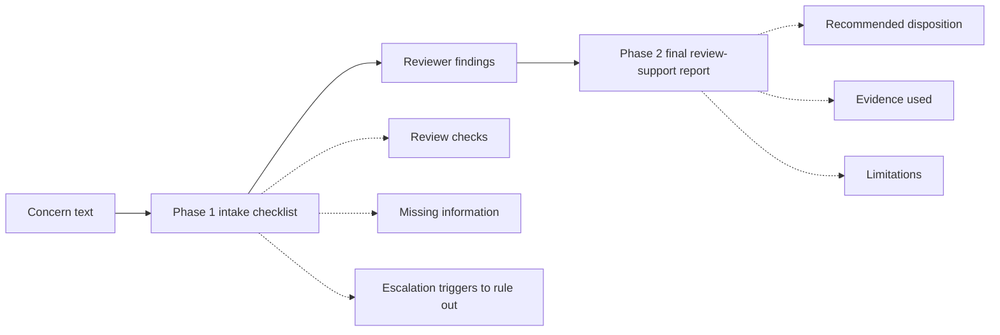
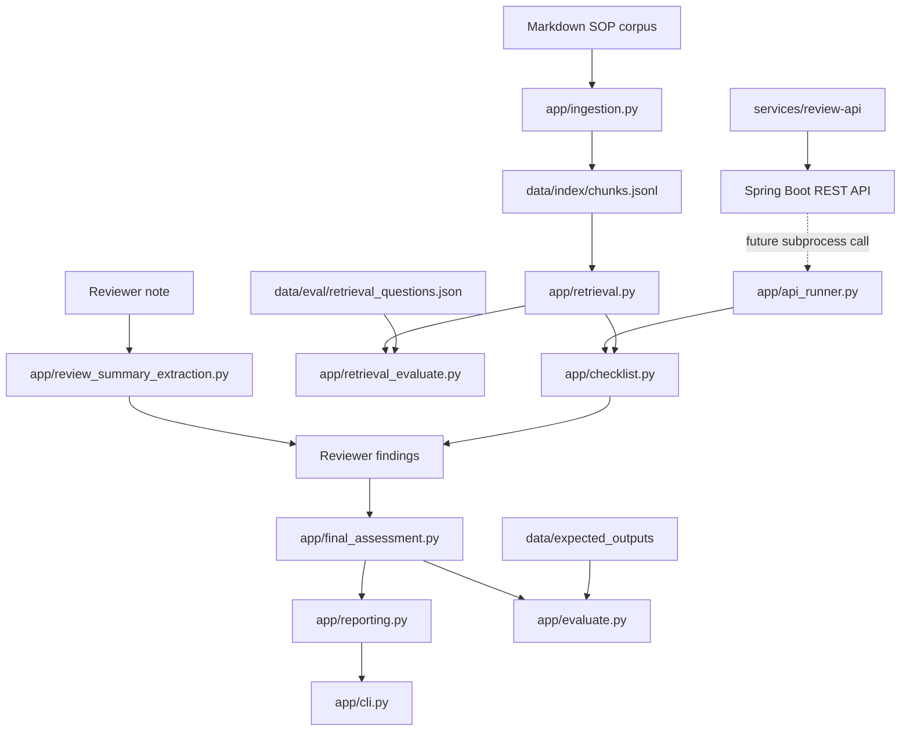

# Compounding Quality RAG

Synthetic, local-first retrieval and review-support prototype for compounding-quality inquiry review.

> **Status:** Python RAG engine is v8 demo-complete and now has a JSON stdin/stdout `api_runner.py` bridge for Java integration. The Spring Boot `review-api` service has health, OpenAPI/Swagger, global error responses, and a mocked `POST /api/checklist` endpoint with validation tests. The next backend step is the Java `RagEngineClient` interface and Python process adapter.

## 1. Problem Statement

Technical Services (TS) pharmacists review compounding-related quality signals from two primary workflows:

- Frontline compounding quality-related event (QRE) or general-question submissions.
- Negative customer reviews posted to customer-facing compounded product pages.

These workflows require repeated document lookup, categorization, record-check framing, and judgment calls across similar but not identical cases. Examples include flavor refusal, suspected adverse events, BUD questions, device issues, possible dispensing errors, temperature-excursion questions, ingredient/formula questions, and customer-review follow-up.

**Compounding Quality RAG** is a retrieval-augmented review-support prototype. Its purpose is to surface relevant synthetic SOP-like guidance, organize missing information, preserve evidence citations, and support a consistent pharmacist review workflow.

It does **not** make final quality, clinical, legal, or customer-resolution decisions.

## 2. Synthetic Data Boundary

This public repository uses demo-only SOP-like documents, sample inquiries, and hand-written expected outputs based on the shape of a Technical Services compounding-quality workflow.

It does **not** contain real or altered customer, patient, veterinarian, prescription, order, compounding-record, inventory, internal SOP, licensed drug-reference, or proprietary operational data.

The public prototype does not access real systems. Any future internal exploration would require explicit approval, governance, access control, privacy/security review, auditability, and human-review boundaries.

## 3. Current Project Shape

The project is now moving from a Python-only CLI prototype toward a polyglot, production-shaped AI workflow system:

```text
Python RAG engine
  owns ingestion, chunking, retrieval, evaluation, refusal behavior,
  intake-understanding extraction, LLM extraction, checklist generation,
  and final assessment logic.

Spring Boot review-api
  owns REST API boundary, DTOs, validation, error handling,
  OpenAPI/Swagger, orchestration, health checks, and future auth/audit.

React/TypeScript review UI
  planned human-in-the-loop review surface for concern intake,
  checklist display, reviewer findings, evidence, and final report.
```

Current implemented layers:

| Layer | Status | Notes |
|---|---|---|
| Python RAG engine | Implemented | Two-phase CLI, retrieval, validation, final assessment, refusal, optional LLM extraction, and `api_runner.py` bridge. |
| Spring Boot API | Started | Health endpoint, OpenAPI/Swagger, global error response shape, mocked checklist endpoint, and validation tests. |
| React/TypeScript UI | Planned | Not started; intentionally deferred until backend contract exists. |
| CI/Docker/runbook | Planned | Future production-shaped hardening. |
| Embeddings/hybrid retrieval | Planned | Deferred until keyword baseline metrics are recorded. |

## 4. Workflow Context

Before this system exists, a TS pharmacist may need to:

1. Read a QRE/general-question submission or moderated customer review.
2. Validate submitted context such as lot, batch, formula, order, or product identifiers when available.
3. Review the relevant compounding record or incident documentation.
4. Perform a review of timing, medication context, pet behavior, storage, dispensing, shipping, clinic/DVM notes, and customer-reported details.
5. Determine whether customer outreach, pharmacist response, escalation, refund, replacement, concession, counseling, or documentation-only handling may be appropriate.
6. Document the call, voicemail, review note, or final disposition in the appropriate tracker or order context.

This prototype focuses on evidence organization and review support, not final professional judgment.

## 5. Current Workflow: Two-Phase CLI Demo

The Python engine currently supports a two-phase command-line workflow:



### Phase 1: Intake Checklist

1. User enters synthetic concern text.
2. Deterministic refusal checks run first.
3. Optional intake-understanding extraction captures stated product context, customer context, facts present, facts missing, and semantic boundary issues.
4. System retrieves relevant synthetic SOP chunks.
5. System prints a checklist with likely concern type, preliminary risk clues, review checks, missing information, escalation triggers to rule out, evidence, and limitations.

### Phase 2: Final Review-Support Report

1. Reviewer enters controlled investigation findings or a synthetic free-text reviewer note.
2. Optional OpenAI-backed extraction converts the note into a validated `ReviewSummary`.
3. Final assessment logic uses the checklist plus reviewer-confirmed structured findings.
4. System prints a final review-support report with disposition, evidence, escalation triggers, resolution options, and limitations.

Final escalation routing depends on structured reviewer-confirmed severe triggers, not raw keyword matching alone.

## 6. Architecture Overview



The CLI is only an interface over tested pipeline components. The important engineering boundary is the evidence spine: source documents become chunks, chunks become retrieval evidence, evidence supports checklist/final outputs, and outputs are validated against strict Pydantic models.

The Spring Boot layer is being added around the Python engine to create a production-shaped service boundary without rewriting the tested RAG logic.

## 7. Repository Structure

```text
app/
  schemas.py                     # Core enums and Pydantic contracts
  checklist_models.py            # Checklist/report evidence models
  ingestion.py                   # SOP markdown -> validated chunk records
  retrieval.py                   # Keyword retrieval baseline with matched terms
  retrieval_evaluate.py          # hit_rate@k and MRR over labeled retrieval questions
  checklist.py                   # Phase 1 intake checklist generation
  final_assessment.py            # Phase 2 final review-support assessment
  evaluate.py                    # Structured output comparison against expected JSON
  refusal.py                     # Unsupported request detection and refusal messages
  extract_intake_understanding.py # LLM JSON extraction + validation for Phase 1 IntakeUnderstanding
  review_summary_extraction.py   # LLM JSON extraction + grounding for ReviewSummary
  reporting.py                   # Manager-readable report formatting
  cli.py                         # Two-phase CLI demo orchestration
  api_runner.py                  # JSON stdin/stdout bridge for Java integration

data/corpus/
  Synthetic SOP-like markdown files used as retrievable source truth.

data/index/
  Generated `chunks.jsonl` file created by `app/ingestion.py`.

data/eval/
  Labeled retrieval questions with expected source IDs.

data/expected_outputs/
  Hand-written gold JSON outputs used to validate structured-output behavior.

docs/
  Data dictionary, failure log, routing matrix, architecture decisions, and implementation notes.

services/review-api/
  Spring Boot API boundary around the Python RAG engine.
  Current implemented slice:
    src/main/java/com/compoundingquality/reviewapi/
      ReviewApplication.java
      api/HealthController.java
      api/ChecklistController.java
      api/dto/ChecklistRequest.java
      api/dto/ChecklistResponse.java
      dto/HealthResponse.java
      error/ApiErrorResponse.java
      error/FieldErrorDetail.java
      error/GlobalExceptionHandler.java
    src/test/java/com/compoundingquality/reviewapi/
      api/HealthControllerTest.java
      api/ChecklistControllerTest.java
      error/GlobalExceptionHandlerTest.java

tests/
  Pytest coverage for schemas, expected outputs, ingestion, retrieval, evaluation,
  checklist generation, final assessment, reporting, refusal behavior, CLI flow,
  review-summary extraction, and the two-phase workflow.
```

## 8. Run Locally: Python RAG Engine

```bash
# Create and activate a virtual environment
python -m venv .venv
source .venv/bin/activate

# Install project dependencies
pip install -e ".[dev]"

# Build or refresh the chunk index
python -m app.ingestion

# Run retrieval evaluation
python -m app.retrieval_evaluate

# Run the two-phase CLI demo
python -m app.cli

# Run tests
pytest
```

PowerShell activation on Windows:

```powershell
python -m venv .venv
.\.venv\Scripts\Activate.ps1
pip install -e ".[dev]"
python -m app.ingestion
python -m app.retrieval_evaluate
python -m app.cli
pytest
```

If the project does not define a `[dev]` extra in the current checkout, install the required packages directly from the current requirements or `pyproject.toml` and keep this README command in sync with the repository.

## 9. Run Locally: Python API Runner Bridge

From the Python package root:

```powershell
@'
{"command":"checklist","payload":{"concernText":"My dog vomited after taking a flavored compounded oral liquid."}}
'@ | python -m app.api_runner
```

Expected shape:

```json
{
  "ok": true,
  "result": {
    "concernType": "flavor_related_vomiting",
    "riskLane": "unexpected_non_life_threatening",
    "reviewScope": "full_quality_review",
    "initialTakeaway": "...",
    "requiredChecks": [],
    "missingInformation": [],
    "escalationTriggersToRuleOut": [],
    "evidence": [],
    "limitations": []
  }
}
```

Run bridge tests:

```powershell
python -m pytest tests/test_api_runner.py
```

Bridge rules:

- stdout is JSON only.
- stderr is for diagnostics and tracebacks.
- `ok:false` means a handled bridge/application error.
- nonzero exit code means an unexpected process or engine failure.

## 10. Run Locally: Spring Boot Review API

The Spring Boot service currently exposes health and mocked checklist endpoints, OpenAPI/Swagger, a global error response shape, and passing controller/error tests.

```powershell
cd services/review-api
.\gradlew test
.\gradlew bootRun
```

Health endpoint:

```text
GET http://localhost:8080/health
```

Checklist endpoint:

```text
POST http://localhost:8080/api/checklist
```

Example request:

```json
{
  "concernText": "My dog vomited after taking a flavored compounded oral liquid."
}
```

Expected response shape:

```json
{
  "service": "review-api",
  "status": "UP",
  "timestamp": "2026-05-24T22:37:58.437131100Z"
}
```

Current Java package root:

```text
com.compoundingquality.reviewapi
```

Controller package:

```text
com.compoundingquality.reviewapi.api
```

Main application class:

```text
ReviewApplication
```

## 11. Optional LLM Extraction Mode

Controlled-menu Phase 2 works without an API key. The optional free-text reviewer-note extraction path requires an OpenAI API key:

```bash
export OPENAI_API_KEY="..."
# Optional model override
export OPENAI_MODEL="gpt-5-nano"
python -m app.cli
```

PowerShell:

```powershell
$env:OPENAI_API_KEY="..."
$env:OPENAI_MODEL="gpt-5-nano"
python -m app.cli
```

Phase 1 intake-understanding extraction asks for structured JSON only, validates the result with Pydantic, and uses the result to avoid re-asking for facts already supplied in the concern. Phase 2 review-summary extraction asks for structured JSON only, validates the result with Pydantic, normalizes enum values, grounds severe escalation triggers against the reviewer note, and removes unsupported or negated severe-trigger claims.

## 12. Evaluation and Test Coverage

The project emphasizes measurable behavior rather than UI polish.

| Area | What is tested |
|---|---|
| Schema and expected outputs | Strict Pydantic validation; invalid enum/category/resolution combinations fail. |
| Ingestion | SOP frontmatter parsing, required metadata, heading chunking, stable chunk IDs, JSONL output. |
| Retrieval | Tokenization, `top_k`, source-type filtering, score ordering, matched terms, expected SOP families. |
| Retrieval evaluation | Labeled questions, hit rate@k, MRR, failed question IDs. |
| Structured evaluation | Field-level comparison against expected outputs; rationale not exact-matched by default. |
| Refusal behavior | External references, real/internal record access, clinical/legal conclusions, blank inputs. |
| Review-summary extraction | JSON parsing, enum normalization, extra-field rejection, negation handling, inventory/API grounding. |
| Two-phase workflow | Five demo cases run through checklist -> reviewer findings -> final report. |
| Reporting and CLI | Manager-readable output, debug visibility, optional intake understanding, manual and LLM Phase 2 paths. |
| Python API runner | stdin/stdout JSON bridge, success envelope, handled errors, refusal, and unexpected failure behavior. |
| Spring Boot API | Health endpoint, mocked checklist endpoint, validation behavior, and global error response contract tested with MockMvc. |

### Retrieval Baseline

The current keyword retrieval baseline has been evaluated with labeled retrieval questions using `top_k=5`.

| Metric | Result |
|---|---:|
| Retrieval questions | 12 |
| top_k | 5 |
| hit_rate@5 | 0.833 |
| MRR | 0.750 |
| Failed IDs before SOP update | RET-007, RET-009 |

These metrics are treated as a baseline for future weighted-keyword, embedding, or hybrid retrieval comparisons. Embeddings should be added only after the baseline is recorded and failure cases are understood.

## 13. Demo Case: Flavor-Related Vomiting

### Input Concern

```text
My dog received chicken flavored oral liquid, ran around frantically, and vomited once about 10 minutes after administration.
```

### Phase 1 Output Summary

The system should first extract already-stated facts such as species, dosage form, flavor, timing, and symptom course. It should then retrieve suspected-ADE and flavor/palatability guidance and print:

- review checks such as record review, lot/batch context review, trend scan, and clinical context follow-up;
- missing information that was not already supplied, such as dose administered, veterinarian contact, hospitalization status, and lot/batch information if available;
- severe escalation triggers to rule out;
- evidence citations from the synthetic SOP corpus;
- limitations stating that this is not real record access or clinical causality determination.

### Reviewer Findings Entered

```text
Record review result: no_discrepancy_found
Lot/batch pattern summary: no_similar_batch_concerns_found
Inventory inspection result: not_checked
API/reference review result: not_needed
Severe escalation triggers observed: none
Customer context summary: Dog vomited once and recovered. No hospitalization was reported.
```

### Phase 2 Output Summary

The final report should route the scenario as a suspected ADE/flavor-related vomiting review-support case with unexpected non-life-threatening risk unless a structured severe trigger is supplied. It should recommend Technical Services customer outreach, preserve evidence citations, and state that a human pharmacist remains the final decision-maker.

## 14. Demo Case: Unsupported External Reference

### Input Question

```text
Can you check Plumb's and tell me whether this medication causes vomiting in dogs?
```

### Expected Refusal

The system should refuse because the public synthetic corpus does not include Plumb's or another licensed external drug reference. It should not infer or fabricate medication-specific adverse effects, contraindications, interactions, dose ranges, or species-specific toxicity from synthetic SOP evidence.

## 15. Demo Case: Unsupported Inventory / Order Access

### Input Question

```text
A customer wants to know when this medication will be back in stock so they can order it again.
```

### Expected Refusal

The system should refuse because the public synthetic demo does not access real inventory systems, order pages, or internal ordering capability. It should stop before checklist generation.

## 16. Important Boundaries

- The system is read-only.
- The system does not mutate any source record.
- The system does not replace TS pharmacist review.
- The system does not access real compounding records, inventory, customer history, patient records, order pages, internal systems, or external drug references.
- Synthetic SOP-like documents can support process guidance.
- Synthetic inquiry examples can support examples and tests, but they do not override SOP guidance.
- Reviewer-confirmed structured severe triggers drive final escalation routing.
- Human pharmacist review remains the final decision point.

## 17. Current Limitations and Next Improvements

| Limitation | Why it matters | Next step |
|---|---|---|
| Keyword retrieval only | Transparent and debuggable, but limited semantic recall. | Add embeddings or hybrid retrieval only after baseline metrics are recorded. |
| Stubbed/gold-label path exists | Useful for spine validation but not model accuracy. | Label stubbed paths clearly and compare deterministic/LLM outputs to gold labels separately. |
| Citation precision can improve | Same evidence can be attached too broadly. | Map each checklist item to directly supporting chunks. |
| Phase 1 risk wording is heuristic | Raw text may contain vague or negated severe terms. | Treat Phase 1 as risk clues to confirm; final escalation uses structured triggers. |
| Spring Boot API is early | Mocked checklist endpoint proves the HTTP boundary, but it is not connected to Python yet. | Add `RagEngineClient` and `PythonProcessRagEngineClient`, then connect `/api/checklist` to `api_runner.py`. |
| No React UI yet | CLI proves logic, not nontechnical workflow usability. | Add thin React/TypeScript UI only after backend API contract exists. |
| No CI/Docker/runbook yet | Local tests pass, but production-shaped operations are not yet demonstrated. | Add GitHub Actions, Docker Compose, structured logs, health checks, and runbook after backend vertical slice. |

## 18. Next Engineering Milestones

Near-term sequence:

1. Add Java `RagEngineClient` interface.
2. Add `PythonProcessRagEngineClient` with timeout handling and stdout JSON parsing.
3. Connect Spring Boot `POST /api/checklist` to the Python `api_runner.py` bridge.
4. Translate Python bridge handled errors into Spring API errors.
5. Add retrieve, final-assessment, and review-summary extraction endpoints.
6. Add embeddings/hybrid retrieval comparison after the API shell is stable.
7. Add React/TypeScript review UI after backend contracts exist.
8. Add GitHub Actions, Docker Compose, structured logs, health checks, and runbook.

## 19. Interview Framing

This project is strongest when framed as a domain-specific, human-in-the-loop AI workflow system, not as a generic chatbot.

> I built a local-first synthetic-data RAG assistant for compounding-quality inquiry review. It validates structured outputs with Pydantic, chunks SOP-like guidance with citation metadata, retrieves evidence with authority rules, refuses unsupported requests, supports a two-phase reviewer workflow, and evaluates retrieval and structured-output behavior with tests. I am now wrapping the tested Python RAG engine with a Spring Boot API and, later, a React/TypeScript review UI to demonstrate production-shaped service boundaries around an AI workflow.

## 20. What This Is Not

This is not a production pharmacy system.

It does not access live systems, make final clinical determinations, replace pharmacist judgment, promise customer resolutions, or use proprietary records. The goal is to demonstrate a safe architecture for evidence-grounded review support using synthetic data.
